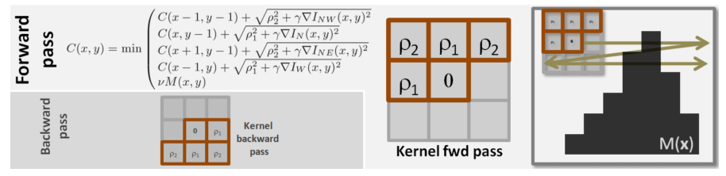
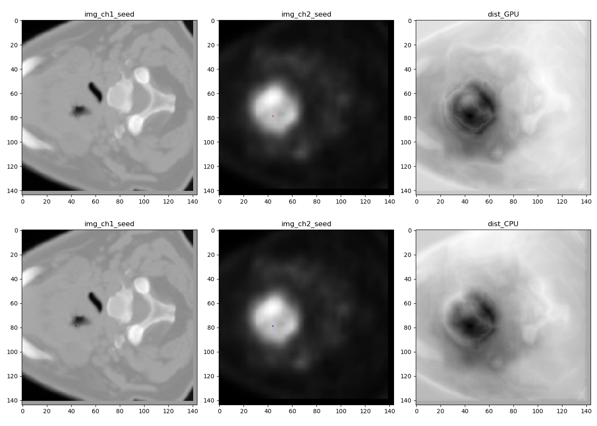

# GPUGeodis: GPU based Geodesic Distance Transform Toolkit for 3D Images 
Geodesic transformation of images can be implementated with two approaches: fast marching and raster scan. Fast marching is based on the iterative propagation of a pixel front with velocity F [2]. Raster scan is based on kernel operations that are sequentially applied over the image in multiple passes [3][4]. In GeoS [5], the authors proposed to use a 3x3 kernel for forward and backward passes for efficient geodesic distance transform, which was used for image segmentation. DeepIGeoS [6] proposed to combine geodesic distance transforms with convolutional neural networks for efficient interactive segmentation of 2D and 3D images.  As part of their work of DeepIGeoS [6], Guotai Wang et.al have provided a  cpp implementation of fast marching and raster scan for 2D/3D geodesic and Euclidean distance transforms and a mixture of them, and proivdes a python interface to use it in[1]. [`If you use their CPP code, please cite their paper.`](https://ieeexplore.ieee.org/document/8370732) 

Raster scan for geodesic distance transform. Image from [5].

* [1] https://github.com/taigw/GeodisTK
* [2] Sethian, James A. "Fast marching methods." SIAM review 41, no. 2 (1999): 199-235.
* [3] Borgefors, Gunilla. "Distance transformations in digital images." CVPR, 1986
* [4] Toivanen, Pekka J. "New geodesic distance transforms for gray-scale images." Pattern Recognition Letters 17, no. 5 (1996): 437-450.
* [5] Criminisi, Antonio, Toby Sharp, and Andrew Blake. "Geos: Geodesic image segmentation." ECCV, 2008.
* [6] Wang, Guotai, et al. "[`DeepIGeoS: A deep interactive geodesic framework for medical image segmentation`](https://ieeexplore.ieee.org/document/8370732)."  TPAMI, 2018. 

Now, in this repository we provide a GPU (PyCUDA)  implementation of only the raste  scan version of the 3D geodesic distance. While the CPP version in [1] consists of a forward and backward pass covering 13 + 13 = 26-voxel nighborhood of each voxel, this GPU version consists of 6 passes in each iteration : 
  - forward direction 
  - - Along depth: read from 9 neighborhood voxel of previous slice and update a voxel
  - - Along height: read from 3 neighborhood voxel of upper row and update a voxel
  - - Along width: read from 1 neighborhood voxel in current row of previous sagittal plane and update a voxel
  - backward direction 
  - - Along depth: read from 9 neighborhood voxel of next slice and update a voxel
  - - Along height: read from 3 neighborhood voxel of lower row and update a voxel
  - - Along width: read from 1 neighborhood voxel in current row of next sagittal plane and update a voxel
  - 
[`If you use this  GPU code, please cite our github.`](https://github.com/supratikbose/GPUGeodis)
Below is an example comparison between the CPP implementation in [1] (bottom row: dist_CPU) and GPU implementation (top row: dist_cpu) of 3D geodesic distance on a multichannel (CT + PET) image. 

### Notes
1. Currently the code assumes the height, width and depth of if each channel of the image volume is a multiple of 8
2. The number of channels may be 1, 2 or 4; The demo code is written for 2 channel image. Change is for single or 4 channel images. Also change scaling and normalization as needed before invoking GPU distance 
3. In the demo code, the code to  run the CPP version [1] is present but is commented out. If you want to generate a comparison, install GeodisTk following [1] and uncomment the demo code.
4. While the code is written in PyCuda, the kernel is obviously is in C-Cuda and also at the bottom of the file src/gpuGeodis.py, one can find the the commented version of the C++ code that can drive the kernel. I originally wrote the code in C++ - CUDA, before converting the driver code into python.
5. I express my sincere thanks to Prof. Ofir Weber (Bar-Ilan University, Israel) and Prof. Guotai Wang (University of Electronic Science and Technology of China) for helpful papers / suggestions.

